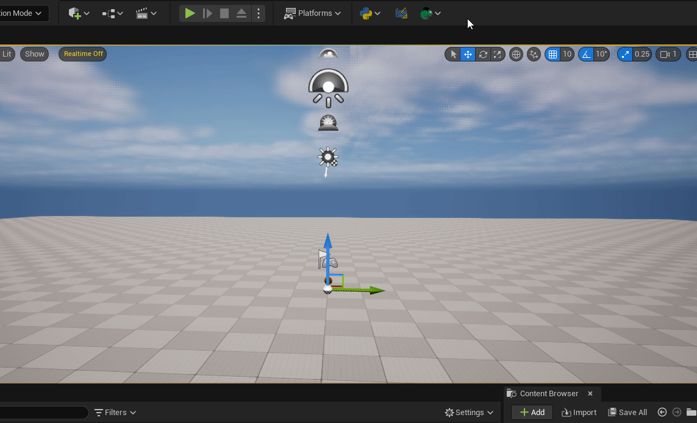

# TAPython_ModalWindow_Example
A modal window example




## How to use

Add Menu Item in `MenuConfig.json`

```ini
...
    {
        "name": "Launch Modal Window From Tools",
        "ChameleonTools": "../Python/ModalWindowExample/ModalWindowExample.json"
    }
...
```

or use below code for launch modal window from python console

```python
unreal.ChameleonData.launch_chameleon_tool('../Python/ModalWindowExample/ModalWindowExample.json')
```

## How it works

In fact, the tool instance of the Modal Window is very similar to the Chameleon tool, so it also has its own corresponding json and python files with the same name. In this example, it is `AModalWindow.json` and `AModalWindow.py`.


We open a Modal Window through `unreal.ChameleonData.modal_window('./ModalWindowExample/AModalWindow.json')` in the `ModalWindowExample` tool. The content in `AModalWindow.json`, except for `"IsModalWindow": true`, the others are consistent with the Chamelon tool.


Then, in `AModalWindow.py`, we add and delete buttons for the Modal Window through `self.data.append_slot_from_json` and `self.data.remove_widget_at`. Of course, if we can also modify this Modal Window in other tools. And change `self.data` to `chameleon_modalwindowinstance.data`. (This variable name is created in `InitPyCmd` in `AModalWindow.json`)
